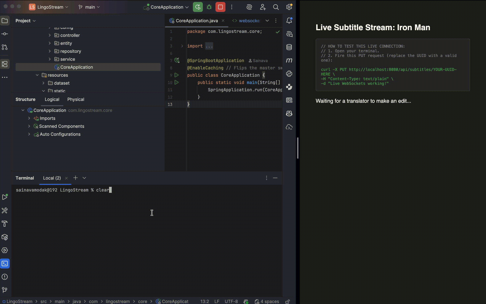

# LingoStream

## The Problem: The Chaos of Collaboration

In traditional collaborative environments, when multiple users attempt to edit the same data simultaneously, race conditions inevitably lead to database corruption. In the context of a live subtitle editing engine, this results in overwritten translations and broken timestamp synchronizations. Furthermore, repeatedly querying a relational database for massive datasets creates severe latency bottlenecks, while static HTTP architectures force users to manually refresh their clients just to see updates.

## The Solution

LingoStream is a highly concurrent, distributed backend designed to solve the bottlenecks of real-time collaborative editing. Built to handle heavy read/write traffic, it actively prevents concurrent data collisions, serves read requests in under 5 milliseconds, and pushes live translation updates to all connected clients instantly without requiring manual intervention.

---

## Core Features

* **Concurrency Control (Distributed Locking):** Utilizes Redisson to implement a distributed locking mechanism. If multiple translators attempt to edit the exact same subtitle line simultaneously, the system safely isolates the first transaction and explicitly rejects subsequent collisions to prevent data corruption.
* **Ultra-Fast Reads (Cache-Aside Pattern):** Intercepts database read queries using a Redis caching layer coupled with automated eviction triggers. This reduces standard database fetch times from ~100ms down to <5ms for high-traffic media.
* **Live Broadcasting (Full-Duplex WebSockets):** Replaces standard HTTP polling by leveraging STOMP over WebSockets, instantly pushing committed database updates to all subscribed clients in real-time.
* **Automated Data Ingestion:** Features a dedicated ingestion engine to parse, clean, and convert multi-language SRT files into a normalized, time-indexed relational schema.
* **Reproducible Infrastructure:** Completely containerized using a multi-stage Dockerfile and Docker Compose, allowing the entire distributed system to be spun up locally with a single command.

---

## Architecture & Project Structure

```text
LingoStream/
├── docker-compose.yml                  # Infrastructure blueprint (PostgreSQL, Redis, App)
├── Dockerfile                          # Multi-stage build instructions for the Spring Boot app
├── pom.xml                             # Maven dependencies (Testcontainers, Redisson, WebSockets)
├── README.md                           # Documentation
└── src/
    ├── main/
    │   ├── java/
    │   │   └── com/
    │   │       └── lingostream/
    │   │           └── core/
    │   │               ├── CoreApplication.java            # Spring Boot entry point
    │   │               ├── config/
    │   │               │   ├── RedissonConfig.java         # Dynamic Redis & Spring Cache config
    │   │               │   └── WebSocketConfig.java        # STOMP message broker config
    │   │               ├── controller/
    │   │               │   └── SubtitleController.java     # Cache-intercepted REST endpoints
    │   │               ├── entity/
    │   │               │   └── SubtitleEntity.java         # Database schema mapping
    │   │               ├── repository/
    │   │               │   └── SubtitleRepository.java     # PostgreSQL data access layer
    │   │               └── service/
    │   │                   ├── DataIngestionRunner.java    # Startup script to parse SRT files
    │   │                   └── SubtitleService.java        # Business logic, locks, & sockets
    │   └── resources/
    │       ├── application.yml                         # Spring Boot properties
    │       ├── dataset/
    │       │   ├── iron-man-1-en.srt                   # Sample English subtitle data
    │       │   └── iron-man-1-jp.srt                   # Sample Japanese subtitle data
    │       └── static/
    │           └── websocket-test.html                 # Live STOMP client for socket verification
    └── test/
        └── java/
            └── com/lingostream/core/
                └── SubtitleIntegrationTest.java        # Testcontainers verification

```

---


## Quick Start: Running LingoStream

Because the entire distributed infrastructure (Application, PostgreSQL database, and Redis cache) is containerized via a multi-stage Docker build, you do not need to install Java, Postgres, or Redis on your local machine to run this project.

### Prerequisites

* Docker Engine installed and running.

### 1. Boot the Distributed System

Clone the repository and spin up the environment using Docker Compose:

```bash
git clone https://github.com/yourusername/lingostream.git
cd lingostream
docker-compose up --build

```

*Note: On the first run, the `DataIngestionRunner` will automatically parse the provided multi-language SRT files in the `/dataset` folder and seed the PostgreSQL database.*

### 2. Verify the Cache & Lock (HTTP)

Once the Spring Boot banner appears in the terminal, you can fetch the English subtitle track for Iron Man. The first request will hit PostgreSQL; subsequent refreshes will be served entirely from the Redis cache.

```bash
curl -X GET "http://localhost:8080/api/subtitles/iron-man-1?language=en"

```

### 3. Verify Live Collaboration (WebSockets)

To see the full-duplex WebSocket broadcasting in action:

1. Open a web browser and navigate to `http://localhost:8080/websocket-test.html`.
2. Grab any UUID from the `GET` request above.
3. Fire a `PUT` request in a separate terminal to edit that specific line:

```bash
curl -X PUT http://localhost:8080/api/subtitles/YOUR-UUID-HERE \
  -H "Content-Type: text/plain" \
  -d "Live WebSockets working!"

```

The browser UI will instantly render the updated database row in real-time, completely bypassing the HTTP polling cycle.

---

## API Reference

### REST Endpoints

| Method | Endpoint | Parameters | Description |
| --- | --- | --- | --- |
| `GET` | `/api/subtitles/{videoId}` | `language` (default: 'en') | Retrieves the subtitle payload. Intercepted by Redis Cache-Aside pattern for <5ms response times. |
| `PUT` | `/api/subtitles/{id}` | `String` (Request Body) | Updates a subtitle line. Triggers the Redisson distributed lock, updates PostgreSQL, evicts the specific cache, and fires a WebSocket broadcast. |

### Real-Time Sockets (STOMP)

| Protocol | Destination | Description |
| --- | --- | --- |
| **Connect** | `/ws` | The initial handshake endpoint for the SockJS client. |
| **Subscribe** | `/topic/subtitles/{videoId}` | The dedicated channel clients subscribe to for receiving real-time, broadcasted updates. |